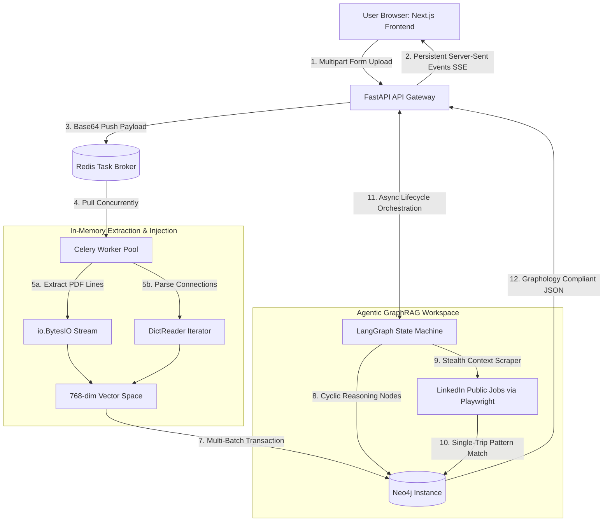

# CareerGraph.OS 🚀

### *An Agentic GraphRAG Networking & Job Matching Platform*

[](https://github.com)
[](https://github.com)
[](https://github.com)
[](https://github.com)

**CareerGraph.OS** is a production-grade, backend-first intelligence dashboard that transforms raw, unstructured personal career footprints into an interactive, multi-hop knowledge graph.

By unifying **Graph Databases** with **Vector Embeddings (GraphRAG)**, the platform bypasses the systemic limitations of traditional linear semantic search, exposing non-obvious referral networks and evaluating resume-to-job matches dynamically through sub-second topological traversals.

---

## 📑 Table of Contents

- [Core Architecture & Data Flow](#️-core-architecture--data-flow)
- [Key Engineering Achievements](#-key-engineering-achievements)
- [Technical Stack Configuration](#️-the-technical-stack-configuration)
- [Local Deployment Lifecycle](#-local-deployment-lifecycle)
- [System Manifest & Directory Map](#-system-manifest--directory-map)
- [System Diagnostics & Metrics](#-system-diagnostics--metrics-tracking)

---

## 🏗️ Core Architecture & Data Flow

The platform separates long-running, non-deterministic workloads (such as file unzipping, PDF parsing, text embedding, and autonomous browser scraping) from the core client web threads using a distributed event-driven microservice pattern.



<details>
<summary><strong>📖 Read the pipeline stage-by-stage</strong></summary>

| Stage | What happens |
| --- | --- |
| 1–2 | Frontend uploads via multipart form; gateway opens a persistent SSE channel back to the browser. |
| 3–4 | Payload is pushed to Redis and pulled concurrently by the Celery worker pool. |
| 5a–6 | PDFs and connection CSVs are parsed in-memory and batch-embedded into a shared vector space. |
| 7 | Vectors are written to Neo4j in a multi-batch transaction. |
| 8–10 | The LangGraph agent reasons cyclically over the graph and drives a stealth Playwright scraper for live job data. |
| 11–12 | The gateway orchestrates the agent's async lifecycle and streams back Graphology-compliant JSON for the UI. |

</details>

---

## ⚡ Key Engineering Achievements

### 1. Privacy by Design: In-Memory Stream Processing

To eliminate the risk of Personally Identifiable Information (PII) leakage, the ingestion engine treats uploaded documents as transient byte objects. File parsing is executed entirely within RAM using `io.BytesIO` buffers and custom string generators. **Zero bytes ever touch physical persistent block storage**, enforcing absolute data sovereignty.

### 2. Deep Structural Traversal via Index-Free Adjacency

Traditional relational databases experience severe performance degradation ($O(\log N)$ or quadratic scaling) when executing deep relational joins. By utilizing Neo4j, CareerGraph.OS leverages native memory pointers to evaluate complex relationship structures in constant time $O(1)$ per hop.

The application visually and programmatically maps out the explicit organizational chain:

**User** ──`[:CONNECTED_TO]`──> **Person** ──`[:WORKS_AT]`──> **Company** <──`[:POSTED_BY]`── **Job**

### 3. Single-Trip Hybrid Vector-Graph Queries

Rather than querying an isolated vector database and joining the results programmatically in Python memory, the Matchmaker agent executes single-trip Cypher transactions that run high-dimensional vector cosine similarity comparisons directly alongside topological pattern match paths:

$$\text{Cosine Similarity} = \frac{\mathbf{A} \cdot \mathbf{B}}{\|\mathbf{A}\| \|\mathbf{B}\|}$$

```cypher
MATCH (u:User {id: $user_id})
WITH u, vector.similarity.cosine(u.embedding, $job_embedding) AS match_score
OPTIONAL MATCH path = (u)-[:CONNECTED_TO*1..2]-(p:Person)-[:WORKS_AT]->(c:Company)
WHERE c.name =~ ('(?i).*' + $company_name + '.*')
RETURN match_score, collect(path) as network_connections
```

### 4. Real-Time UI Stepping via Server-Sent Events (SSE)

To manage user experience across multiple backend processing contexts, the `/api/v1/ingest` pipeline communicates over a unidirectional persistent text pipe (`text/event-stream`). The API streams granular lifecycle states (uploading, task extraction, graph generation, layout computation) sequentially down to the client, keeping the visual layout decoupled from network delays.

### 5. Hardware-Accelerated Network Visualization

Standard SVG or Canvas rendering systems collapse when handling large network structures due to excessive DOM repaint calculations. CareerGraph.OS delegates graph spatialization to the GPU via **Sigma.js and WebGL**. The canvas processes force-directed layout clusters under the ForceAtlas2 physics model, executing animations fluidly at **60fps**.

---

## 🛠️ The Technical Stack Configuration

| Layer | Component | Technical Rationale |
| --- | --- | --- |
| **Frontend UI** | `Next.js 16 (Turbopack)` | Fast component rendering, unified server caching, and responsive flex design templates. |
| **API Gateway** | `FastAPI (Python)` | High-throughput asynchronous event loops powered by Starlette and Pydantic validation. |
| **Data Orchestrator** | `Celery + Redis` | Offloads blocking I/O and intensive embedding calculations from the HTTP worker threads. |
| **AI Graph Layer** | `Neo4j Database` | Enforces structural relational safety while handling 3072-dimension semantic vectors. |
| **Agentic Workspace** | `LangGraph Engine` | Builds a resilient state machine using conditional edges to prevent LLM tool loops. |
| **Automation Tool** | `Playwright Stealth` | Emulates browser environments to scrape live job feeds while bypassing bot-detection hooks. |

---

## 🚀 Local Deployment Lifecycle

### Prerequisites

- Docker & Docker Compose installed
- Python 3.11+ environment
- Node.js 18+ runtime
- Google Gemini API Key

### 1. Spin Up the Infrastructure Layer

Boot up the pre-configured database instances and task queues containerized via Docker:

```bash
docker compose up -d
```

### 2. Initialize Backend & Run Seed Constraints

Navigate to the backend directory, isolate dependencies within a virtual environment, and construct your Neo4j constraints and schema definitions:

```bash
cd backend
python -m venv venv
./venv/Scripts/activate  # On Windows PowerShell
pip install -r requirements.txt

# Run database schema initializations
python init_schema.py
```

### 3. Launch Distributed Systems Tasks

Fire up the Celery worker pool process configured for local single-thread task management, alongside your FastAPI runtime server:

```bash
# In your Celery terminal window
celery -A tasks.celery_app worker --loglevel=info -P solo

# In your FastAPI terminal window
python main.py
```

### 4. Start Frontend Layer

Open a new shell inside the root folder and boot up the Next.js frontend container with the high-performance Turbopack engine:

```bash
npm install
npm run dev
```

Navigate your browser to `http://localhost:3000` to interact with the platform.

---

## 📂 System Manifest & Directory Map

```text
├── backend/                      # Async FastAPI Layer
│   ├── agents/                   # Multi-Agent State Node Routines
│   │   ├── orchestrator.py       # LangGraph Cyclic Management Engine
│   │   ├── matchmaker.py         # Single-Trip Cypher Execution Service
│   │   └── scraper.py            # Playwright Stealth Automation Engine
│   ├── services/                 # Core Functional Algorithms
│   │   ├── embedding_service.py  # Gemini Dimension Padding Adapters
│   │   ├── linkedin_parser.py    # Buffer-Isolated CSV Iterators
│   │   └── pdf_parser.py         # Stream-Based Resume Text Scrapers
│   ├── tasks.py                  # Celery Distributed Blueprint Bindings
│   └── main.py                   # Gateway Router & SSE Event Loop Controller
├── frontend/                     # Next.js UI Core
│   └── app/                      # WebGL Layout Canvas Components
└── docker-compose.yml             # Multi-Container Neo4j & Redis Specifications
```

---

## 📈 System Diagnostics & Metrics Tracking

The engine maintains a footprint logged under local tracking layers (`errorLogs.md`, `learning.md`). During end-to-end integration QA, the following system signatures have been established:

- **In-Memory File Parsing Lifecycle:** ~2.04 seconds for 50 records.
- **Network Graph Frame Rate:** Stable 60fps under WebGL rendering configurations.
- **API Ingestion Footprint:** Enforces a rigid 1,000-request daily buffer boundary to ensure compliance with external rate limits.

---

<p align="center">Built with a stubborn refusal to let a resume be just a PDF. 🕸️</p>
