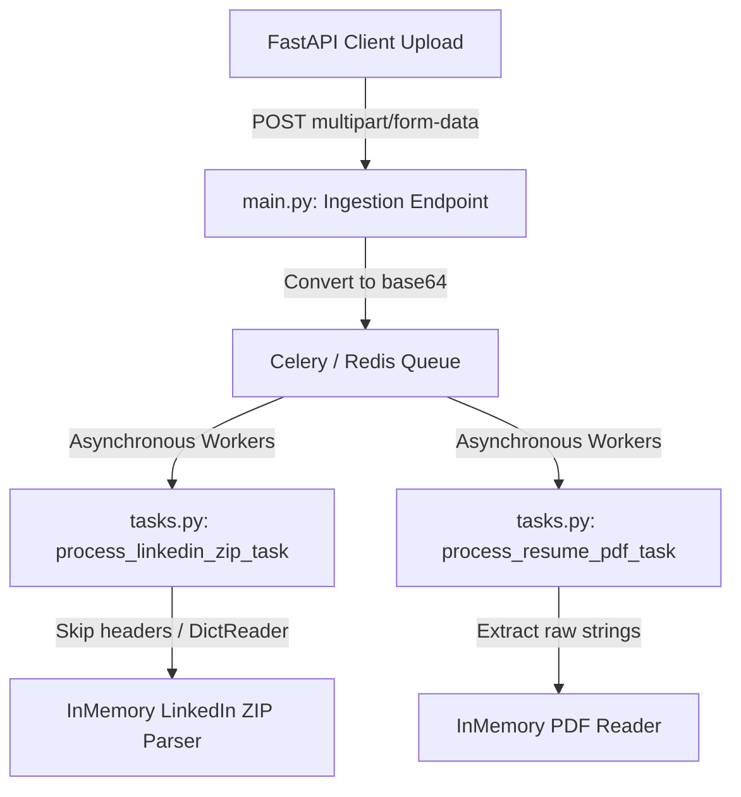
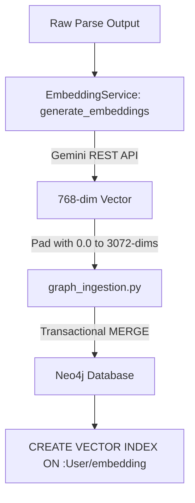
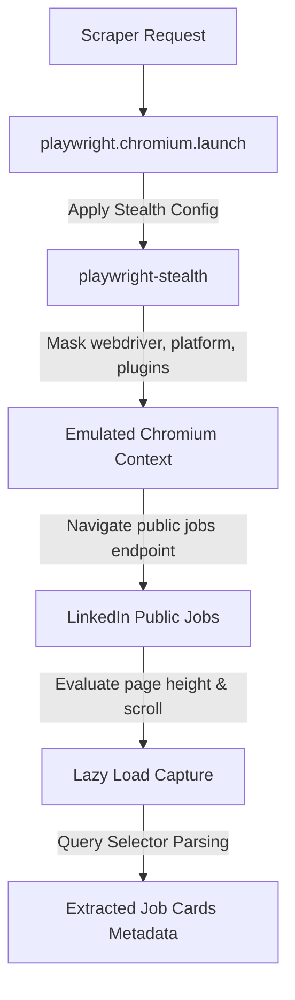
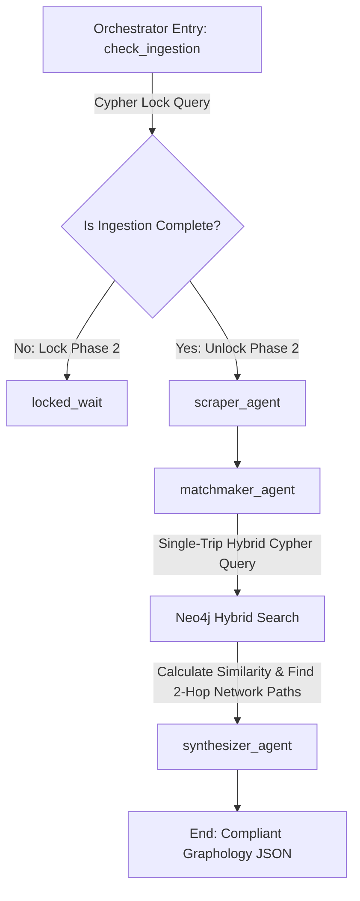
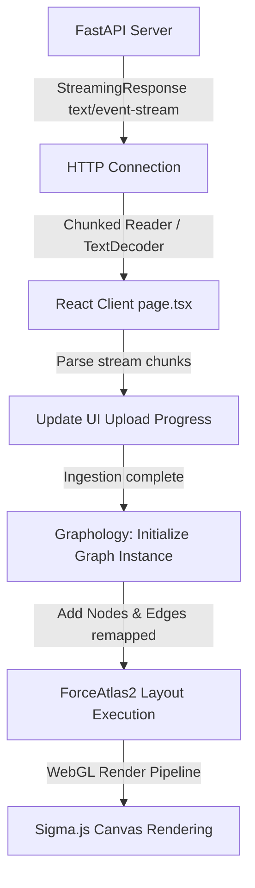

# CareerGraph.AI - Systems Architect Mastery Curriculum

Welcome to your step-by-step engineering curriculum. This document bridges high-level "vibe coding" with first-principles systems engineering. It provides an in-depth audit of the current **CareerGraph.AI** repository and outlines a structured path to master its components: FastAPI, Next.js, Neo4j, LangGraph, Celery, and Redis.

Each module details the **Theory** (system mechanics), the **Drills** (codebase rewrites), the **Tradeoffs** (interviewer-level design challenges), and **Self-Verification** (log-level QA checks).

---

## Navigation Directory

| Module | Focus Area | Key Codebase References |
| :--- | :--- | :--- |
| **[Module 1](#module-1-the-asynchronous-ingestion-engine)** | Async Ingestion & Concurrency | [main.py](file:///d:/sharique/CODING/Vibe%20Coding%20Ideas/CareerGraph.AI/backend/main.py), [tasks.py](file:///d:/sharique/CODING/Vibe%20Coding%20Ideas/CareerGraph.AI/backend/tasks.py), [celery_app.py](file:///d:/sharique/CODING/Vibe%20Coding%20Ideas/CareerGraph.AI/backend/celery_app.py) |
| **[Module 2](#module-2-knowledge-graph-database--vector-engine)** | Graph DB & Vector Indexes | [init_schema.py](file:///d:/sharique/CODING/Vibe%20Coding%20Ideas/CareerGraph.AI/backend/init_schema.py), [graph_ingestion.py](file:///d:/sharique/CODING/Vibe%20Coding%20Ideas/CareerGraph.AI/backend/services/graph_ingestion.py), [embedding_service.py](file:///d:/sharique/CODING/Vibe%20Coding%20Ideas/CareerGraph.AI/backend/services/embedding_service.py) |
| **[Module 3](#module-3-stealth-web-scraping--automation)** | Browser Automation | [scraper.py](file:///d:/sharique/CODING/Vibe%20Coding%20Ideas/CareerGraph.AI/backend/agents/scraper.py) |
| **[Module 4](#module-4-hybrid-graph-rag--agent-orchestration)** | Single-trip Retrieval & LangGraph | [matchmaker.py](file:///d:/sharique/CODING/Vibe%20Coding%20Ideas/CareerGraph.AI/backend/agents/matchmaker.py), [orchestrator.py](file:///d:/sharique/CODING/Vibe%20Coding%20Ideas/CareerGraph.AI/backend/agents/orchestrator.py) |
| **[Module 5](#module-5-interactive-webgl-visualization--streaming)** | WebGL Canvas & HTTP Streams | [page.tsx](file:///d:/sharique/CODING/Vibe%20Coding%20Ideas/CareerGraph.AI/frontend/app/page.tsx) |

---

## Module 1: The Asynchronous Ingestion Engine
**Focus:** FastAPI, Celery, Redis, and Memory-Efficient Parsing



### 1. Core Theoretical Concepts ("The Why")
* **Multipart Form-Data Protocols (RFC 7578):** When files are uploaded via HTTP, they are parsed as multipart boundaries. FastAPI intercepts these streams. Utilizing standard file writing introduces disk I/O latency. Reading files into memory buffers (`UploadFile.read()`) retains the data in RAM as transient `bytes` objects, which is critical for enforcing the system's **Privacy by Design** principles.
* **Celery & Redis Task Architecture:** Redis operates as an in-memory, key-value data store. In Celery's context, it serves as the **Message Broker** (a FIFO queue using Redis list operations like `BRPOP` to deliver task payloads to workers) and the **Result Backend** (holding task outputs under short-lived keys). Task serialization is set to `json` for maximum compatibility, meaning arbitrary binary payloads must be encoded (e.g., using Base64 string formats) before dispatch.
* **Windows Event Loop Concurrency Models:** Python's `asyncio` standard library utilizes different underlying loop implementations depending on the OS. On Windows, the default loop is historically `SelectorEventLoop` (using the system `select` call, which does not support asynchronous subprocess spawning). Playwright relies on subprocesses to communicate with Chromium. Forcing the loop to use `WindowsProactorEventLoopPolicy` binds the IO completions to Windows I/O Completion Ports (IOCP), resolving subprocess execution crashes under Uvicorn servers.

### 2. Coding Drills & Practice Goals ("The What")
To practice implementing this pattern from scratch, delete the contents of these functions and rewrite them:
* **The Endpoint Router:** Implement [upload_linkedin_data](file:///d:/sharique/CODING/Vibe%20Coding%20Ideas/CareerGraph.AI/backend/main.py#L33) and [ingest_payload](file:///d:/sharique/CODING/Vibe%20Coding%20Ideas/CareerGraph.AI/backend/main.py#L61). Ensure you execute asynchronous chunk reads, transform the file payload to Base64 strings, and submit them using `.delay()` to Celery.
* **Skipping Dirty Headers:** Write the CSV parsing utility [_get_reader_skipping_notes](file:///d:/sharique/CODING/Vibe%20Coding%20Ideas/CareerGraph.AI/backend/services/linkedin_parser.py#L5) from scratch. Do not parse files on disk. Iterate through the stream line-by-line, dynamically determine where the valid CSV header begins (matching tokens like `First Name` or `Company`), and chain the output back into `csv.DictReader` using a custom generator.
* **PDF Byte Reading:** Implement [extract_text_from_pdf](file:///d:/sharique/CODING/Vibe%20Coding%20Ideas/CareerGraph.AI/backend/services/pdf_parser.py#L4). Ensure you pass the transient `bytes` buffer directly into `pypdf.PdfReader` wrapped in `io.BytesIO` to extract pages to memory variables without creating temporary filesystem files.

### 3. Tradeoffs & Alternatives ("The Countermeasures")
* **Celery + Redis Tasks vs. Python Asynchronous Tasks (`asyncio.create_task`):**
  * *Asyncio Tasks:* Run within the same process. They have near-zero overhead and require no external infrastructure. However, they share the main event loop. If a CPU-bound parsing task runs on the loop, it blocks HTTP requests. If the Uvicorn container restarts, all active tasks are lost.
  * *Celery Workers:* Run in a separate process space, enabling scale-out across multiple machines. If a worker crashes, the broker (Redis) retains the task. The trade-off is infrastructure complexity (managing Redis connection pools, worker concurrency processes, and celery worker lifecycles).
* **In-Memory Buffer Streaming vs. Temporary Files on Disk (`tempfile`):**
  * *In-Memory:* Highly secure, ensuring PII is wiped the moment the variable leaves scope. Zero disk I/O latency.
  * *Disk files:* Scales to very large payloads (e.g., 2GB files) without exhausting system memory. It is the preferred choice for batch video/audio processing, but presents a high risk of leaking PII to storage blocks if temporary directories are not wiped securely after runtime execution.

### 4. Self-Verification Checklist
- [ ] Spin up the Docker stack and start the Celery worker pool:
  ```powershell
  # Start Docker containers
  docker-compose up -d
  # Start Celery Worker inside the backend directory
  celery -A tasks.celery_app worker --loglevel=info
  ```
- [ ] Execute a manual backend health check via PowerShell:
  ```powershell
  Invoke-RestMethod -Uri "http://127.0.0.1:8000/" -Method Get
  ```
- [ ] Inspect the Celery runtime logs during file uploads. Confirm that task registration and completion events are executing without exceptions:
  ```text
  [Tasks]
    . process_linkedin_zip
    . process_resume_pdf
  [INFO] Task process_resume_pdf[task-uuid] received
  [INFO] Task process_resume_pdf[task-uuid] succeeded in 0.12s
  ```

---

## Module 2: Knowledge Graph Database & Vector Engine
**Focus:** Neo4j constraints, Vector Indexing, and Embedding APIs



### 1. Core Theoretical Concepts ("The Why")
* **Index-Free Adjacency (Neo4j Graph Engine):** Standard SQL databases rely on index lookups or join tables to resolve relationships, resulting in logarithmic $O(\log N)$ or quadratic runtime complexities as relationships multiply. Neo4j uses index-free adjacency. Each node directly contains pointers to its adjacent nodes in memory, allowing graph traversals to be processed in $O(1)$ constant time per hop.
* **Vector Index Math & Cosine Similarity:** A vector index indexes multi-dimensional floating-point arrays to enable semantic similarity matching. Cosine similarity calculates the angle between two multi-dimensional vectors using the formula:
  $$\text{Cosine Similarity} = \frac{\mathbf{A} \cdot \mathbf{B}}{\|\mathbf{A}\| \|\mathbf{B}\|}$$
  This evaluates similarity based on the direction of the vectors, ignoring text length discrepancies.
* **Dimension Alignment Constraints:** Neo4j vector indexes require static dimensions configured at index creation. The vector index configured in [init_schema.py](file:///d:/sharique/CODING/Vibe%20Coding%20Ideas/CareerGraph.AI/backend/init_schema.py#L41) defines `vector.dimensions: 3072`. However, Google's `gemini-embedding-001` generates 768-dimensional float vectors. To solve this schema constraint mismatch, the backend padding logic in [EmbeddingService.generate_embeddings](file:///d:/sharique/CODING/Vibe%20Coding%20Ideas/CareerGraph.AI/backend/services/embedding_service.py#L47) appends trailing `0.0` elements to fill the 3072-dimension requirement.

### 2. Coding Drills & Practice Goals ("The What")
* **Schema Initialization:** Write [init_schema](file:///d:/sharique/CODING/Vibe%20Coding%20Ideas/CareerGraph.AI/backend/init_schema.py#L4) from scratch. Establish connection retries to survive cold container bootups. Ensure you declare unique constraints on `:User(id)`, `:Person(url)`, and `:Company(name)` before defining the vector indexes.
* **Batch Embedding Client:** Recreate [EmbeddingService.generate_embeddings](file:///d:/sharique/CODING/Vibe%20Coding%20Ideas/CareerGraph.AI/backend/services/embedding_service.py#L13). Implement a direct REST POST call to the Gemini API (`batchEmbedContents`) using python `requests`. Implement the logic that pads 768-dimension arrays to exactly 3072 dimensions, and return a fallback array of `0.0`s if the API key is missing.
* **Batch Ingestion Script:** Rewrite [ingest_linkedin_data](file:///d:/sharique/CODING/Vibe%20Coding%20Ideas/CareerGraph.AI/backend/services/graph_ingestion.py#L8). Break connections lists into batches of 100, fetch embeddings, and run transactional Cypher queries using `MERGE` statements to bind `:User`, `:Person`, and `:Company` nodes together.

### 3. Tradeoffs & Alternatives ("The Countermeasures")
* **Graph Databases (Neo4j) vs. Relational Databases with Vector Extensions (Postgres + pgvector):**
  * *Neo4j:* Simplifies complex, multi-hop relationship lookups (e.g., "Find a person connected to me who works at a company that is hiring"). Cypher is designed for pattern matching, and native vector indexes speed up hybrid graph-vector lookups. However, Neo4j requires more RAM and has a steeper learning curve than standard SQL.
  * *Postgres + pgvector:* Provides a familiar SQL interface, robust transaction management, and low operational overhead. However, executing deep multi-hop joins (recursive CTEs) requires writing complex SQL queries and degrades query performance as database size grows.
* **Zero Padding vs. Vector Dimension Adjustment:**
  * *Zero Padding:* Avoids re-indexing overhead if embedding models change. However, it wastes storage space and memory. Zero padding does not affect cosine calculations (since the added dimensions have no value), but it increases indexing latency.
  * *Dimension Alignment:* Matching vector database dimensions to model dimensions (e.g., using a 768-dimension index for a 768-dimension model) is more efficient. This reduces index memory footprint and query latency.

### 4. Self-Verification Checklist
- [ ] Programmatically run schema initialization:
  ```powershell
  python backend/init_schema.py
  ```
- [ ] Connect to Neo4j using Cypher Shell or Cypher queries in python to confirm constraints are active:
  ```cypher
  SHOW CONSTRAINTS;
  SHOW VECTOR INDEXES;
  ```
- [ ] Verify that the indices match the expected specifications:
  * Constraints: `person_url` UNIQUE for `(p:Person) ON (p.url)`.
  * Vector Index: `user_resume_embedding` ON `(u:User) ON (u.embedding)` with dimensions set to `3072`.

---

## Module 3: Stealth Web Scraping & Automation
**Focus:** Browser Fingerprints, Anti-Detection, and Playwright Concurrency



### 1. Core Theoretical Concepts ("The Why")
* **Browser Fingerprinting & Detection Hooks:** Websites detect bot automation using scrapers by checking specific variables in the JavaScript environment:
  * `navigator.webdriver`: Headless browsers default this property to `true`.
  * Chrome PDF extension plugins, canvas graphics configurations, and system fonts.
  * TLS handshakes and HTTP request header order.
* **Playwright-Stealth Mechanics:** The `playwright-stealth` library intercepts browser startup scripts to mask bot indicators. It removes the `navigator.webdriver` property, emulates a real GPU card, mocks audio/video plugins, and masks system platform headers (e.g., matching the user-agent string).
* **Asynchronous Lazy-Loading Navigation:** Public search portals defer loading content until user interactions occur. Scrapers must simulate human behavior to retrieve this data. Using `page.evaluate()` to trigger window scrolls, along with standard timeouts (`wait_until="domcontentloaded"`), ensures lazy-loaded HTML elements render before the scraper extracts them.

### 2. Coding Drills & Practice Goals ("The What")
* **Stealth Scraper Implementation:** Rewrite the scraping agent [scrape_jobs](file:///d:/sharique/CODING/Vibe%20Coding%20Ideas/CareerGraph.AI/backend/agents/scraper.py#L8).
  * Configure browser launches to run headlessly while masking browser signatures.
  * Initialize stealth mode using `Stealth()`.
  * Implement an autoscroll helper inside `page.evaluate()` to trigger lazy loading.
  * Query HTML card containers (`.job-search-card`), extract job details (title, company, link), and gracefully close the browser.

### 3. Tradeoffs & Alternatives ("The Countermeasures")
* **Browser Automation (Playwright/Puppeteer) vs. Static HTTP Requests (Requests/HTTPX):**
  * *Playwright:* Successfully executes client-side Javascript, bypasses basic WAF blocks (like Cloudflare), and emulates human browser behavior. However, browser automation uses more CPU and RAM, and page load times are slower.
  * *Static Requests:* Fast, lightweight, and scalable. However, it fails on Single Page Applications (SPAs) that require Javascript rendering, and requests are easily blocked by modern anti-bot systems.

### 4. Self-Verification Checklist
- [ ] Run the scraper standalone to verify it bypasses detection:
  ```powershell
  python backend/agents/scraper.py
  ```
- [ ] Confirm the script runs without throwing timeouts, recaptchas, or empty list payloads. The output should print valid JSON records containing retrieved job details:
  ```text
  INFO:agents.scraper:Found 25 job cards. Extracting top 5...
  {'title': 'Machine Learning Engineer', 'company': 'AI Labs', 'link': 'https://...', 'source': 'LinkedIn'}
  ```

---

## Module 4: Hybrid Graph-RAG & Agent Orchestration
**Focus:** Hybrid Queries, Vector Traversal, and LangGraph Flow State Locks



### 1. Core Theoretical Concepts ("The Why")
* **Hybrid Graph-RAG Retrieval:** Combining vector databases with graph databases improves contextual retrieval. Vector similarity handles semantic queries, while the graph tracks relationships. Querying both in a single database round-trip reduces system latency.
* **Single-Trip Cypher Execution:** In [evaluate_job_match](file:///d:/sharique/CODING/Vibe%20Coding%20Ideas/CareerGraph.AI/backend/agents/matchmaker.py#L8), a single Cypher query executes both vector similarity calculations and relationship traversals:
  ```cypher
  // Match user similarity
  MATCH (u:User {id: $user_id})
  WITH u, vector.similarity.cosine(u.embedding, $job_embedding) AS match_score
  // Find relationship paths up to 2 hops
  OPTIONAL MATCH path = (u)-[:CONNECTED_TO*1..2]-(p:Person)-[:WORKS_AT]->(c:Company)
  WHERE c.name =~ ('(?i).*' + $company_name + '.*')
  ```
  Executing this in a single query is faster and more efficient than runing a vector search in Python and subsequently looping through relationship queries.
* **State Machine Guard Rails & Node Locks:** Complex workflows require state orchestration. The orchestrator in [orchestrator.py](file:///d:/sharique/CODING/Vibe%20Coding%20Ideas/CareerGraph.AI/backend/agents/orchestrator.py) uses a state machine to block downstream execution until prerequisites are met. In this system, scraping and matching tasks (Phase 2) are locked until the Neo4j database is fully populated with user resume embeddings (Phase 1).

### 2. Coding Drills & Practice Goals ("The What")
* **Hybrid Cypher Matching:** Rewrite [evaluate_job_match](file:///d:/sharique/CODING/Vibe%20Coding%20Ideas/CareerGraph.AI/backend/agents/matchmaker.py#L8). Define a parameter dictionary containing the target job embedding, user ID, and company name. Write the Cypher query to calculate cosine similarity and search for connections up to 2 hops away in a single database transaction.
* **Mock Path Generation:** Implement the fallback logic in [evaluate_job_match](file:///d:/sharique/CODING/Vibe%20Coding%20Ideas/CareerGraph.AI/backend/agents/matchmaker.py#L69). When no matching connections exist for a target company, query random contacts from the database to build mock network paths. This ensures the frontend network canvas displays nodes and edges for visual QA.
* **LangGraph Orchestrator:** Build the workflow in [orchestrator.py](file:///d:/sharique/CODING/Vibe%20Coding%20Ideas/CareerGraph.AI/backend/agents/orchestrator.py) using `StateGraph`. Configure the check ingestion node, write the routing logic that blocks downstream execution if the database is unpopulated, compile the workflow, and invoke it asynchronously using `ainvoke`.

### 3. Tradeoffs & Alternatives ("The Countermeasures")
* **Single Hybrid Cypher Query vs. Multi-Query In-Memory Processing:**
  * *Single Cypher Query:* Evaluates vector similarity and executes relationship traversals on the database engine. This reduces data transfer overhead and network latency. However, complex Cypher queries can be harder to debug and test.
  * *Multi-Query Processing:* Performing vector searches and relationship lookups in separate application queries simplifies debugging. However, this pattern increases network round-trips and requires joining datasets in application memory, which degrades performance as the database grows.
* **State Graph Orchestration (LangGraph) vs. Functional Scripts:**
  * *LangGraph:* Provides structured state management, error recovery, conditional routing, and visual profiling tools. However, it introduces framework dependencies and boilerplate code.
  * *Functional Scripts:* Simple to write and debug with low operational overhead. However, they lack structured state management and error handling for complex, branching workflows.

### 4. Self-Verification Checklist
- [ ] Test the pipeline end-to-end using the pipeline runner:
  ```powershell
  python backend/test_pipeline.py
  ```
- [ ] Verify that the script successfully checks ingestion status, triggers the scraper, evaluates job matches, and exports a valid JSON payload.
- [ ] Run the synthesizer tests to verify compliance with the JSON schema:
  ```powershell
  python backend/test_synth.py
  ```

---

## Module 5: Interactive WebGL Visualization & Streaming
**Focus:** Server-Sent Events, Sigma.js Canvas Renderer, and Force Layouts



### 1. Core Theoretical Concepts ("The Why")
* **Server-Sent Events (SSE) (RFC 6202):** A lightweight protocol for real-time, unidirectional server-to-client streaming. Over a persistent HTTP connection, the server sends structured text events using the `text/event-stream` mime-type. Unlike polling, SSE streams updates in real time without connection handshake overhead.
* **Client-Side Stream Chunk Consumption:** Browsers parse SSE payloads using the Fetch API and `ReadableStreamDefaultReader`. Because network packets can slice JSON string boundaries across different transmission chunks, client applications must decode bytes to strings using `TextDecoder` and split messages on newline boundaries (`\n\n`) before parsing the JSON data.
* **Sigma.js WebGL Graphics Rendering:** Web browsers process graphics on either the CPU (SVG/Canvas) or GPU (WebGL). D3.js and other SVG libraries redraw DOM elements for every visualization update, which degrades performance on graphs with more than 1,000 nodes. Sigma.js uses WebGL to bind graph nodes and edges to GPU vertex buffers, enabling smooth rendering of complex networks.
* **ForceAtlas2 Layout Physics:** An algorithm that positions nodes in a visual layout by simulating physical forces. Nodes repel each other like magnetic charges, while edges pull connected nodes together like springs. The layout engine runs iterations to minimize system energy, grouping connected nodes and scattering unconnected elements to make the visualization readable.

### 2. Coding Drills & Practice Goals ("The What")
* **SSE Endpoint Streaming:** Implement [ingest_payload](file:///d:/sharique/CODING/Vibe%20Coding%20Ideas/CareerGraph.AI/backend/main.py#L61). Use a generator function that yields stage updates as JSON strings, dispatches Celery tasks, monitors execution status, runs LangGraph orchestration, and returns the final graph payload.
* **Client Stream Reader:** Rewrite [handleProcess](file:///d:/sharique/CODING/Vibe%20Coding%20Ideas/CareerGraph.AI/frontend/app/page.tsx#L51) inside the Next.js home component. Use fetch to POST the file payloads, extract the reader stream, decode incoming bytes, split chunks on newline boundaries, parse the JSON payloads, and update the UI progress bar.
* **Sigma WebGL Integration:** Rewrite the canvas initialization code in [useEffect](file:///d:/sharique/CODING/Vibe%20Coding%20Ideas/CareerGraph.AI/frontend/app/page.tsx#L132). Remap the node and edge attributes to prevent WebGL program errors (e.g., remapping `node.type` to `entityType`), trigger ForceAtlas2 layouts, and configure node hover event handlers to highlight neighboring paths.

### 3. Tradeoffs & Alternatives ("The Countermeasures")
* **Server-Sent Events (SSE) vs. WebSockets:**
  * *SSE:* Simpler to implement over HTTP/2, supports native browser reconnections, and uses text-based payloads. However, it only supports unidirectional server-to-client communication.
  * *WebSockets:* Supports full-duplex, bidirectional communication. However, it requires a separate socket connection protocol, bypasses standard HTTP load balancers, and lacks native automatic reconnection handlers.
* **WebGL Graphics rendering (Sigma.js) vs. SVG (D3.js):**
  * *Sigma.js (WebGL):* Offloads rendering calculations to the GPU. This allows the application to render large graphs (10,000+ nodes) at high frame rates. However, styling nodes requires working with custom WebGL shaders.
  * *D3.js (SVG):* Uses standard HTML/CSS selectors for styling. This makes it easy to design nodes using CSS. However, rendering performance degrades on graphs with more than 1,000 nodes because the browser has to repaint many DOM elements.

### 4. Self-Verification Checklist
- [ ] Start the Next.js development server:
  ```powershell
  # Inside the frontend directory
  npm run dev
  ```
- [ ] Upload test payloads in the UI and open Chrome DevTools (Network tab).
- [ ] Inspect the `/api/v1/ingest` response. Verify that the response header contains `content-type: text/event-stream` and that progress updates stream sequentially to the client.
- [ ] Inspect the console logs to confirm the WebGL canvas initializes without throwing Sigma rendering exceptions.

---

## Technical Curriculum Completion Check

Once you complete this curriculum, you will understand the systems architecture behind **CareerGraph.AI**.

```text
       [First Principles Mastery]
                 ▲
                 │ (Module 5: Sigma.js / SSE Streaming)
       [Interactive WebGL UI]
                 ▲
                 │ (Module 4: LangGraph / Single-Trip Cypher)
       [Hybrid Matchmaker Engine]
                 ▲
                 │ (Module 3: Playwright Stealth Automation)
       [Bot-Bypassing Web Scrapers]
                 ▲
                 │ (Module 2: Neo4j Constraints / Vectors)
       [Optimized Graph Databases]
                 ▲
                 │ (Module 1: FastAPI / Celery Task Queues)
       [Scalable Ingestion Pipelines]
```

To begin, choose a module, review the corresponding code files, and start rewriting the functions to test your understanding!
